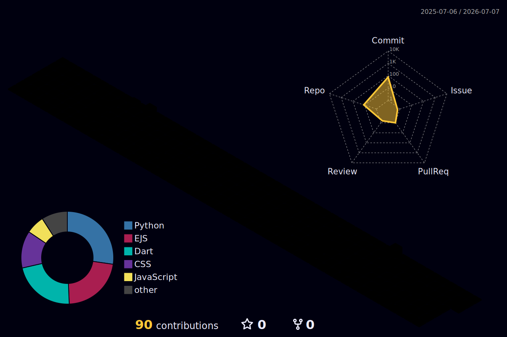
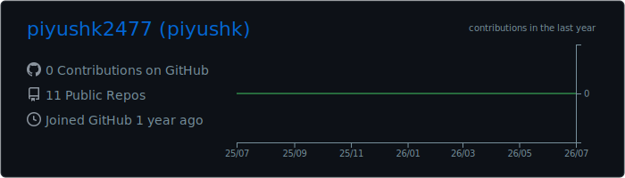
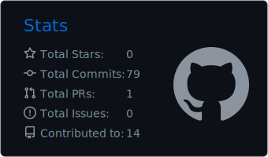
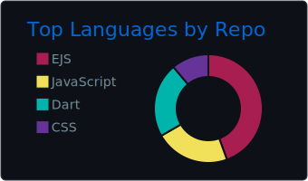
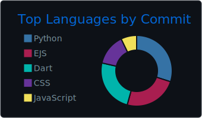
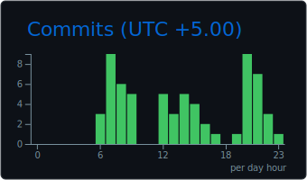

<!-- ════════════════════════ HEADER ════════════════════════ -->

  

  <b>🟣 Agentic AI</b> &nbsp;·&nbsp; <b>🔵 Blockchain</b> &nbsp;·&nbsp; <b>🟢 Full Stack</b>

  I enjoy building end-to-end web applications, on-chain apps, and practical AI agents — 
  taking ideas from database → backend → UI → deploy, and from prompt → agent → production.

<!-- Socials -->

  
  
  
  

 

<!-- ════════════════════════ ABOUT ════════════════════════ -->
##  About

- 🧠 Going deep on **AI agents** — RAG, tool-use, LangGraph orchestration, MCP & LLMOps
- ⛓️ Building **on-chain** — Solidity smart contracts, dApps, ERC-20/721, DeFi tooling
- 🛠️ **Full-stack** delivery — React, Node, Express, Mongo/Postgres, clean architecture
- 🎓 Computer Engineering student who loves turning ideas into working products
- 📫 Reach me: **piyushkanakdande@gmail.com**

 

<!-- ════════════════════════ TECH STACK ════════════════════════ -->
## 🧰 Tech Stack

### 🟣 Agentic AI

 

### 🔵 Blockchain

 

### 🟢 Full Stack
**Languages**
 

 
**Frontend**
 

 
**Backend & Databases**
 

 
**App Development**
 

### 🛠️ Dev Tools

 

<!-- ════════════════════════ FEATURED PROJECTS ════════════════════════ -->
## 📌 Featured Projects — Three Worlds

| World | Project | What it does | Stack |
|:--:|---|---|---|
| 🟣 | **YOUR_AGENTIC_PROJECT** | *AI research / task agent — push your best agent repo here* | Python · LangGraph · RAG |
| 🟣 | **YOUR_AI_PROJECT_2** | *Medical / Legal AI assistant with guardrails* | FastAPI · Vector DB · LLM |
| 🔵 | **YOUR_BLOCKCHAIN_PROJECT** | *NFT marketplace / Voting DApp / Token launchpad* | Solidity · Hardhat · Ethers.js |
| 🟢 | [StayNearCampus](https://github.com/piyushk2477/StayNearCampus) | Hostel & PG listing platform for students | Node · Express · EJS · Tailwind |
| 🟢 | [BlogyAI](https://github.com/piyushk2477/BlogyAi) | Web app to discover the latest AI tools | EJS · Node · MongoDB |
| 🟢 | [music-match](https://github.com/piyushk2477/music-match) | Compare songs & artists with friends | JavaScript |

 

<!-- ════════════════════════ 3D CONTRIBUTIONS ════════════════════════ -->
## 🏙️ Contribution Skyline

  

 

<!-- ════════════════════════ STATS ════════════════════════ -->
## 📊 GitHub Stats

<!--
  These cards are SVG files generated INSIDE this repo by the
  profile-summary-cards GitHub Action (.github/workflows/profile-summary.yml).
  They always render (no external rate limits) and auto-refresh every day.
-->

  

  
  

  
  

  

 

  

 

<!-- ════════════════════════ FOOTER ════════════════════════ -->

## 🤝 Let's Connect

<i>Have an idea worth shipping? Let's build something amazing.</i>
  

